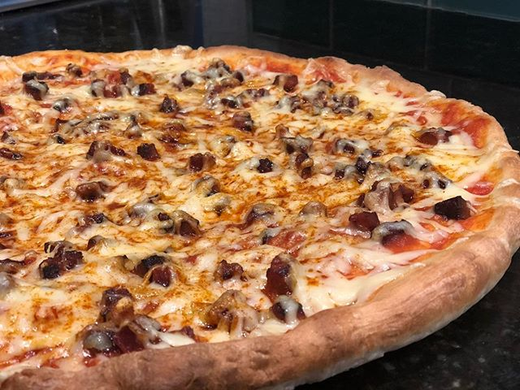

---

layout: recipe
title:  "The Albrecht"
image: 
tags: pizza

directions:
- Add the tomato sauce, cooked chorizo. 
- Add the shredded cheese. Consider adding Manchego next time as well. 
- Sprinkle with paprika. 
- Cook the pizza at 500 degrees for 10 minutes

components:
- Tomato sauce
- Chorizo
- Sweet/Smoked Paprika
- Jarlsberg Cheese

---

Inspired by Don and Carmen and the fusion of Norwegian Flamenco. Ole!