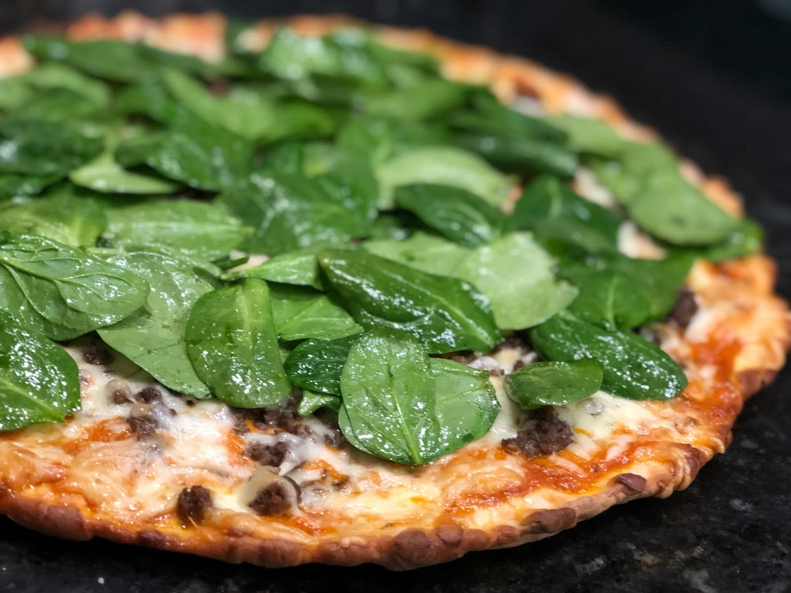

---

layout: recipe
title:  "The Albrecht"
image: 
tags: pizza

directions:
- Use the aioli as the sauce
- Add the cooked ground beef. If you don't use all the ground beef, that's okay. 
- Add the shredded cheese
- Cook the pizza at 500 degrees for 10 minutes
- Meanwhile make a salad out of the Spinach, oil and salt. 
- When the pizza comes out, add the salad to the top of it and serve immediately. 

components:
- Make a pizza dough using a beer-based dough
- 1lb ground beef, cooked with dry chimichurri herbs and salt added
- Shredded and smoked chedder cheese
- Aioli: 1 cup mayonnaise, 1T adobo sauce, and 1/2 lime, squeezed
- To make the adobo sauce: 1T tomato paste, 1T cider vinegar, smoke paprika, cumin, oregano, dash chipolte, garlic powder, salt.
- Spinach, truffle oil, olive oil, and salt

---

Inspired by Chris Albrecht, when he suggested to make a pizza using Ketchup. I got close, with tomato paste :) 